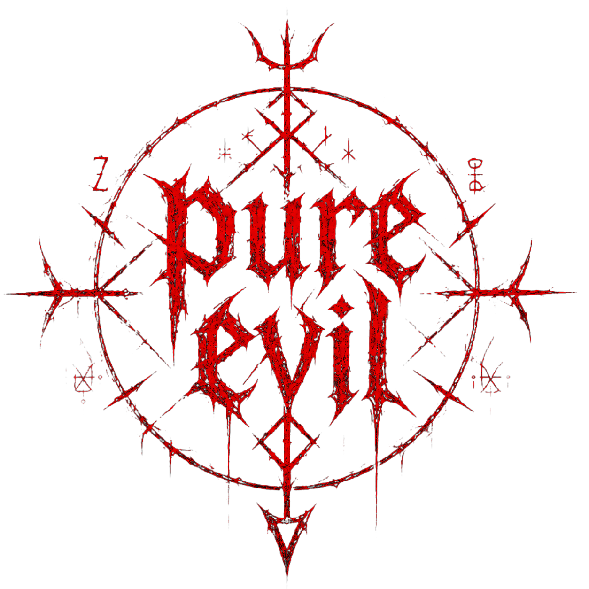
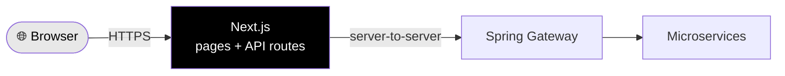

<div align="center">



# pure-evil-web

**The Next.js storefront for PURE EVIL STORE**

[](https://nextjs.org/)
[](https://www.typescriptlang.org/)
[](https://tailwindcss.com/)
[](https://www.framer.com/motion/)
[](https://next-intl-docs.vercel.app/)

</div>

---

## What is this?

The customer-facing storefront of Pure Evil Store. Beyond just showing pages, it also acts as a **secure gateway** between the browser and the backend services — the browser never talks to the microservices directly.

**What it handles:**
- 🛍️ The storefront UI — home, products, auth pages
- 🔒 Secure sessions — keeps tokens in HttpOnly cookies, away from JavaScript
- 🌐 Two languages — English & Vietnamese (next-intl)
- 🎨 Dark-first design — built on CSS variables, theme-switchable

---

## Project Structure

```
src/
├── app/                    # Pages & API routes (Next.js App Router)
│   ├── [locale]/           # All pages live here, prefixed by language
│   │   ├── (auth)/         # Login & register pages
│   │   ├── layout.tsx      # Root layout — fonts, theme, i18n
│   │   └── page.tsx        # Home page
│   └── api/                # Server-side endpoints (the gateway layer)
│
├── features/               # Code grouped by feature, not by type
│   ├── auth/               # Login & register (components, hooks, services)
│   └── home/               # Home page sections (hero, featured…)
│
├── shared/                 # Reusable building blocks
│   ├── ui/                 # Dumb components — Button, Input, Sigil
│   ├── types/              # Shared TypeScript types
│   └── utils/              # Helper functions
│
├── components/             # Global components (e.g. theme provider)
├── lib/                    # API client & external library config
└── i18n/                   # Language routing config
```

**The idea:** each feature is self-contained — its UI, logic, and API calls live together under `features/`. Anything reused across features moves to `shared/`.

---

## Why Next.js sits in the middle

The browser talks to **Next.js**, and Next.js talks to the backend — not the other way around.



This keeps things safe and simple:
- 🔐 Secrets stay on the server, never shipped to the browser
- 🍪 Sessions live in HttpOnly cookies — safe from XSS
- 🙈 Internal service URLs stay private
- 🧩 One place to handle auth, retries, and request shaping

---

## Internationalization (i18n)

Two languages, prefixed in the URL: **`/en/...`** and **`/vi/...`** (default: `en`).

Always import navigation from `@/i18n/routing` so the language prefix is added automatically:

```ts
import { Link } from "@/i18n/routing";

<Link href="/login">Login</Link>   // → /en/login or /vi/login
```

---

## Caching *(coming soon)*

Next.js caching will be added gradually as the backend stabilises — ISR for product pages, on-demand revalidation on updates, and edge caching via Cloudflare.

---

## Getting Started

```bash
# Install dependencies
npm install

# Set up environment variables (see table below)
cp .env.local.example .env.local

# Run the dev server
npm run dev
```

Open **http://localhost:3000**

### Environment Variables

| Variable | What it's for |
|----------|---------------|
| `PROFILE_SERVICE_URL` | Where the Profile service lives |
| `KEYCLOAK_URL` | Keycloak server address |
| `KEYCLOAK_REALM` | Keycloak realm name |
| `KEYCLOAK_CLIENT_ID` | OAuth2 client ID |
| `KEYCLOAK_CLIENT_SECRET` | OAuth2 secret — **server only, never exposed** |
| `NEXT_PUBLIC_API_BASE_URL` | Base URL for browser requests (optional) |

### Scripts

```bash
npm run dev      # Development server
npm run build    # Production build
npm run start    # Run production build
npm run lint     # Lint the code
```

---

## Tech Stack

| | |
|---|---|
| **Framework** | Next.js 16 (App Router) |
| **Language** | TypeScript 5 |
| **Styling** | Tailwind CSS v4 + CSS variables |
| **Animation** | Framer Motion 12 |
| **i18n** | next-intl |
| **Theming** | next-themes |
| **Icons** | lucide-react |

---

<div align="center">
<sub>Part of the <a href="../README.md">Pure Evil Store</a> monorepo</sub>
</div>
